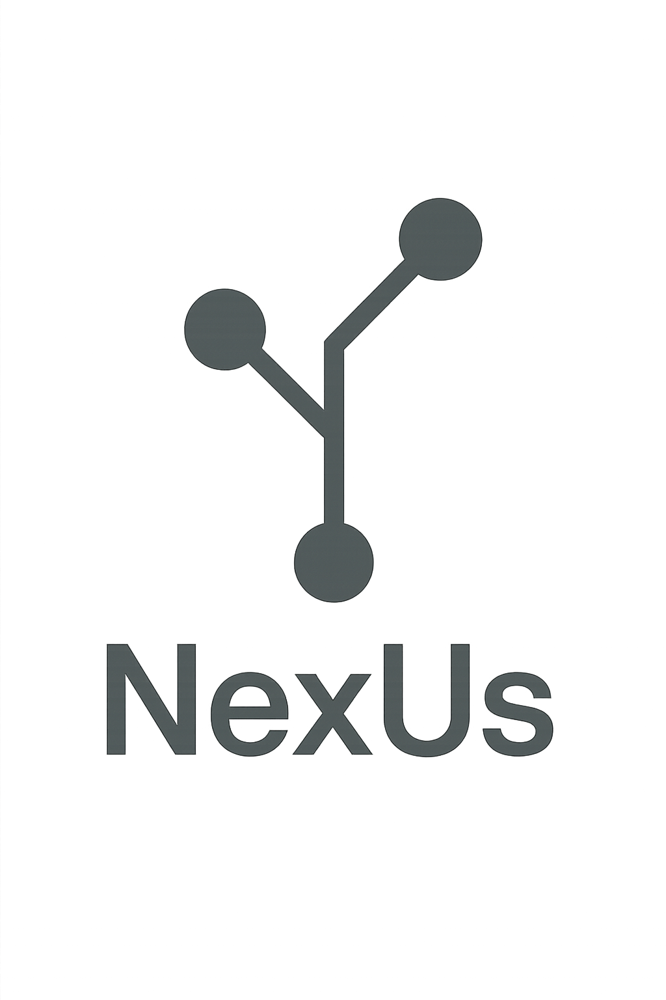

# NexUs



**Welcome to NexUs, a versioning system designed for anonymous collaborative innovation, where your contributions are respected, your autonomy is valued, and every commit tells a story!**

*For the documentation, we assume that the keyword `nexus` is an alias to client executable generated by `go build dir_client/client.go`*

# Philosophy

**Designed to work on Linux filesystems accepting concurrent read of files**

## Do not trust anybody

This versioning enables 2 levels of trust.

During the creation of the NexUs server, the creator of the server can distribute 2 pairs of **RSA keys** to future collaborators of the NexUs project.

One pair of RSA keys is for `standard users`.

Standard users can see any projects available on the NexUs server, download those they want to collaborate on, create branches.... But each of their commits is sent over a specified location on the server reserved for `standard users` to not interfere with the work of `admin users` (distinct with their RSA keys).

An `admin user` can see all the branches standard and admin users have created, download them, look into their `README` or directly into the source code and see what changes they have made. 

A `standard user` can only see `admin users` branches, download them...

And as said before each commit of `standard users` is directly sent over a specified location on the NexUs server reserved for `standard users`. So if a group of `standard users` or a single `standard user` want to work on their own branch and want it to not be modified by others users, they have to name it with a `password` as the end of the branch name for example.

In practice, it may look like this `project_featureA_password`

## Consistency

So any users with a valid pair of RSA keys can download the available NexUs projects on the NexUs server anywhere they want. But the philosophy of NexUs emphases on developping consistency. So if you want to work on the downloaded project branch, be sure to download it in the exact specified filepath.

In practice if a project is named `ssd1_projectdir`, download it in `/home/username/ssd1/projectdir`, because all `_` corresponds to `/` and the project name starts from the `username` in the filepath.

Example:

```
 $ nexus seeproject 123.123.123.123:8080
ssd1_projectdir
ssd1_projectdir2
ssd1_projectdir3
 $ mkdir ssd1
 $ mkdir ssd1/projectdir
 $ cd ssd1/projectdir
ssd1/projectdir $ nexus seebranch 123.123.12.123:8080@ssd1_projectdir
main
featureA
featureB
featureC
ssd1/projectdir $ nexus branchget 123.123.123.123:8080@ssd1_projectdir/main
ssd1/projectdir $ nexus bring ssd1_projectdir
```

## User's autonomy

Sometimes when the work areas of each contributors is well defined and that we trust in each one, syncing the files we don't work on is non-optimal, because of the size of the files we won't touch taking too long to download.

In this case, if we know that another admin have not modified any of my working files during previous commit, just syncing the commit history is a good idea.

If we really want to see the changes the other contributors have made to their working files, we can download the entire project with a desired commit depth (last commits we want).

**This is the NexUs assumption**

# Client commands

## Define a directory where all the NexUs projects are stored

The clien let you choose the directory where all the contents are loaded from.

This can be achived by changing the value of `base_dir` at line 20 of `client.go`, must ends with a `/`, example: `"/home/kvv/ssd1/NexUs/dir_client/"` 

## Setting RSA pair

In the defined `base_dir`, create the file `pubKey.pem` containing the shared public RSA key transfered by the administrator of the NexUs server. Do the same for `privateKey.pem` for the private RSA key.

To know if you are an administrator or a standard user do:

```
$ nexus whoami host
Admin user / Standard user
```

## 2 ways to initiate a project

First way, create a directory where you want to create your project, then do `nexus init`

This will create your project with the name of your filepath with `/` replaced with `_`, keep in mind it is by designed, see later on this documentation.

Second way, get a project from a NexUs server. Do `nexus branchget host@project_name/branchname`

Then create a directory with a filepath that fits the project name, enter and then do:

```
project/name $ nexus bring project_name
```

And voilà, now you have the content of the last commit in your working project directory and all setup client side to bring changes to the project.

## What happen when i add?

When you add files and/or directories before commiting changes, they are stored in the `base_dir/project_name/branchname/sas` directory.

At this point you can remove what is in the `base_dir/project_name/branchname/sas` directory with `nexus rm`

## Automatic adding

Because after each commit, you have to manually add all the directories, files you have to for your current branch of the project, the `addorder` command is here to simplify this process.

To create an `addorder`, do:

```
ssd1/projectdir $ nexus addordernew file1.txt file2.txt dirA dirA/* ...
```

To see the content of `addorder` do:

```
ssd1/projectdir $ nexus addordersee
```

To clear the `addorder` do:

```
ssd1/projectdir $ nexus addorderclear
```

Now each time you have to add the changed files do:

```
ssd1/projectdir $ nexus addorder

```

To locate the addorder for you current project branch do:

```
ssd1/projectdir $ nexus addorderlocate
```

## See changes through commits

A `diff --side-by-side algorithm` is implemented, so you can see the content differences of a file through commits.

Example:

```
ssd1/projectdir $ nexus commitlist
commit - 0 : 3a627f67b013f858703c12c0bf3b6f963d2d2fa1cd88ece57463128323b60e62
commit - 1 : 4a627f67b013f858703c12c0bf3b6f963d2d2fa1cd88ece57463128323b60e62
commit - 2 : 5a627f67b013f858703c12c0bf3b6f963d2d2fa1cd88ece57463128323b60e62
commit - 3 : 6a627f67b013f858703c12c0bf3b6f963d2d2fa1cd88ece57463128323b60e62
ssd1/projectdir $ nexus commitdiff 0 1 a.tx a.txt
sdsd | sdsd
dddfdf | dddfdf
ss | ss //0 changes
```

Now let's talk about how a user can see the filestructure difference through commits

For that a special file is used that tracks in order all the files and directories that are added in each comit process. So to effectively see the filestructure diff through commits, you have to use the `addorder command` for each commit process.

```
ssd1/projectdir $ nexus commitstructdiff 0 1
The left commit is: 3a627f67b013f858703c12c0bf3b6f963d2d2fa1cd88ece57463128323b60e62
The right commit is: 4a627f67b013f858703c12c0bf3b6f963d2d2fa1cd88ece57463128323b60e62
####
ssd1/NexUs/dir_teste4 | ssd1/NexUs/dir_teste4
ssd1/NexUs/dir_teste4/a.txt | ssd1/NexUs/dir_teste4/a.txt
```

To compare the filestrcture of your `sas` content and another commit do:

```
ssd1/projectdir $ nexus sasstructdiff 0
```

## Go back to a previous commit

To identify wich commit number you have to go back do:

```
ssd1/projectdir $ nexus commitlist
commit - 0 : 3a627f67b013f858703c12c0bf3b6f963d2d2fa1cd88ece57463128323b60e62
commit - 1 : 3a627f67b013f858703c12c0bf3b6f963d2d2fa1cd88ece57463128323b60e62
commit - 2 : 3a627f67b013f858703c12c0bf3b6f963d2d2fa1cd88ece57463128323b60e62
commit - 3 : 3a627f67b013f858703c12c0bf3b6f963d2d2fa1cd88ece57463128323b60e62
commit - 4 : f614d844fc86bffd0723c10084463b79137f7614886d94bb18b6dd104acfa92e
commit - 5 : 3a627f67b013f858703c12c0bf3b6f963d2d2fa1cd88ece57463128323b60e62
commit - 6 : f614d844fc86bffd0723c10084463b79137f7614886d94bb18b6dd104acfa92e
```

Now if you want to go back to commit 5 do:

```
ssd1/projectdir $ nexus commitgoback 5
```

Each `commitgoback` comand is treated as a new commit, so you can revert a `commitgoback` with a `commitgoback`

## But wait, how to commit ?

Just do:

```
ssd1/projectdir $ nexus commit "commit_message"
commit hash: f614d844fc86bffd0723c10084463b79137f7614886d94bb18b6dd104acfa92e
```

To see the last commit do: `commitlast`

To see the commit message of a specified commit, first spot the right commit number you want with `commitlist`, then do `commitmsg commitnumber`

## Branches

To create a new branch from a NexUs project do:

```
ssd1/projectdir $ nexus branchnew branchname
```

You can also list branches with `branchlist` and see on what branch you are with `branchmy`

To switch over a created branch do:

```
ssd1/projectdir $ nexus branchswitch branchnametoswitchon
```

To bring a file from another branch do (example we are on main2 and the file to bring is on main):

```
ssd1/projectdir $ mkdir subdir
ssd1/projectdir $ nexus branchbring main subdir/a.txt
```

# Communication with server

## See the available projects

To see the available NexUs project from a NexUs server, do:

```
ssd1/projectdir $ nexus
```

